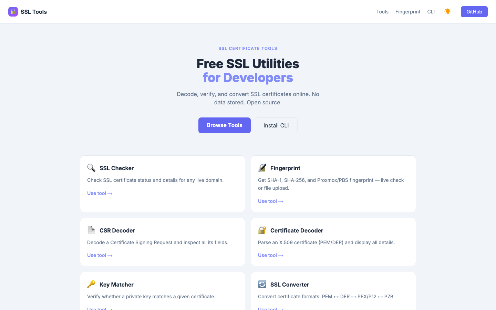
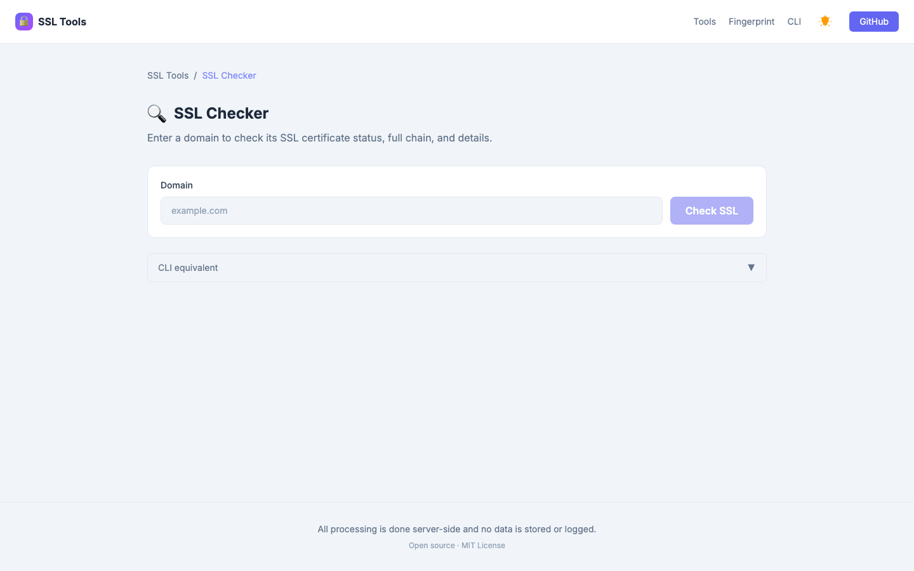
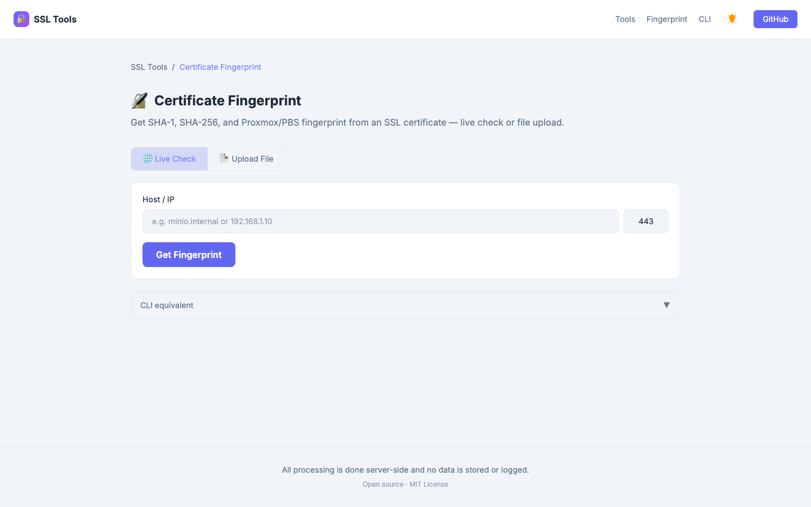
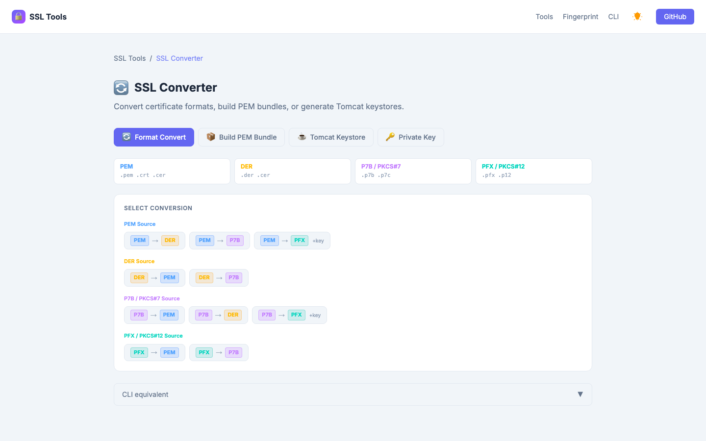

# SSL Certificate Tools

[](https://ssl.nugi.biz)
[](https://github.com/nugiabdiansyah/ssl-certificate-tools/releases)
[](LICENSE)

Free, open-source SSL certificate utilities for developers and sysadmins. Available as a **web app** at [ssl.nugi.biz](https://ssl.nugi.biz) and as a **CLI binary** for Linux, macOS, and Windows.

No data is stored or logged. All processing is done server-side (web) or locally (CLI).

---

## ✨ Features

| Tool | Web | CLI |
|------|-----|-----|
| **SSL Checker** — live chain, trust, IP, server type | ✅ | ✅ `check` |
| **Fingerprint** — SHA-1, SHA-256, Proxmox/PBS format | ✅ | ✅ `fingerprint` |
| **CSR Decoder** — parse certificate signing requests | ✅ | ✅ `decode-csr` |
| **Certificate Decoder** — parse X.509 PEM/DER | ✅ | ✅ `decode-cert` |
| **Certificate Key Matcher** — verify key ↔ cert pair | ✅ | ✅ `match` |
| **SSL Converter** — PEM ↔ DER ↔ PFX ↔ P7B | ✅ | ✅ `convert` |
| **Build PEM Bundle** — fullchain.pem for nginx/HAProxy | ✅ | ✅ `bundle` |
| **Tomcat Keystore** — PKCS#12 with full chain | ✅ | ✅ `tomcat` |
| **Private Key Convert** — add/remove passphrase | ✅ | ✅ `key` |

---

## 🌐 Web App

**Live at → [ssl.nugi.biz](https://ssl.nugi.biz)**

### Screenshots

> Add screenshots to `docs/screenshots/` and update the paths below.






### Pages

- `/ssl-checker` — check a live domain's certificate chain, expiry, trust status, IP, and server type
- `/fingerprint` — get SHA-1/SHA-256/Proxmox fingerprint from a live endpoint or uploaded cert file
- `/csr-decoder` — decode a CSR and inspect all subject fields
- `/cert-decoder` — parse any X.509 certificate (PEM or DER)
- `/key-matcher` — verify a private key matches a certificate
- `/ssl-converter` — convert formats, build PEM bundles, generate Tomcat keystores, encrypt/decrypt keys
- `/cli` — download CLI binaries and command reference

---

## ⌨️ CLI

### Installation

#### Install via Cargo

Requires a [Rust toolchain](https://rustup.rs):

```bash
cargo install ssl-tools
```

#### Download binary (recommended)

Download the prebuilt binary for your platform from the [Releases page](https://github.com/nugiabdiansyah/ssl-certificate-tools/releases/latest):

| Platform | File |
|----------|------|
| macOS (Apple Silicon) | `ssl-tools-aarch64-apple-darwin` |
| macOS (Intel) | `ssl-tools-x86_64-apple-darwin` |
| Linux (x86_64) | `ssl-tools-x86_64-unknown-linux-gnu` |
| Windows (x86_64) | `ssl-tools-x86_64-pc-windows-msvc.exe` |

```bash
# macOS / Linux — make executable and move to PATH
chmod +x ssl-tools-aarch64-apple-darwin
sudo mv ssl-tools-aarch64-apple-darwin /usr/local/bin/ssl-tools

# Verify
ssl-tools --version
```

#### Build from source

Requires [Rust toolchain](https://rustup.rs):

```bash
git clone https://github.com/nugiabdiansyah/ssl-certificate-tools.git
cd ssl-certificate-tools/apps/cli
cargo build --release
# Binary at: target/release/ssl-tools
```

---

### Commands

#### `ssl-tools check` — SSL Checker
```bash
ssl-tools check example.com
ssl-tools check example.com --port 8443
ssl-tools check example.com --json
```

#### `ssl-tools fingerprint` — Certificate Fingerprint
```bash
# Get SHA-1, SHA-256, and Proxmox/PBS format fingerprint
ssl-tools fingerprint minio.internal:9000

# Show PBS config snippets (storage.cfg, proxmox-backup-client)
ssl-tools fingerprint minio.internal:9000 --pbs

# JSON output
ssl-tools fingerprint minio.internal:9000 --json
```

Example output with `--pbs`:
```
✓ *.minio.internal (minio.internal:9000)

Issuer:  My Internal CA
SHA-1:   AB:CD:EF:...
SHA-256: 12:34:56:78:...

Proxmox / PBS Format:
  sha256:12:34:56:78:...

PBS Config Snippets:

  fingerprint field:
  12:34:56:78:...

  CLI argument (proxmox-backup-client):
  --fingerprint 12:34:56:78:...
```

#### `ssl-tools decode-cert` — Certificate Decoder
```bash
ssl-tools decode-cert certificate.crt
ssl-tools decode-cert certificate.crt --json
```

Outputs: Common Name, Organization, Issuer, Serial, validity dates, Public Key, SHA-1, SHA-256, SANs.

#### `ssl-tools decode-csr` — CSR Decoder
```bash
ssl-tools decode-csr request.csr
ssl-tools decode-csr request.csr --json
```

#### `ssl-tools create-csr` — CSR Creator
```bash
# Default: ECDSA P-384 private key + CSR
ssl-tools create-csr --cn example.com --san example.com --san www.example.com

# Generate RSA 4096 and encrypt the private key
ssl-tools create-csr --cn example.com --key-algorithm rsa-4096 --encrypt-key --passphrase secret

# Create CSR from an existing private key
ssl-tools create-csr --cn example.com --key private.key --csr-output request.csr
```

#### `ssl-tools match` — Certificate Key Matcher
```bash
ssl-tools match certificate.crt private.key
```

#### `ssl-tools convert` — Format Converter
```bash
# PEM → DER
ssl-tools convert cert.pem --to der

# PEM → PFX (requires private key)
ssl-tools convert cert.pem --to pfx --key private.key --passphrase secret

# PFX → PEM
ssl-tools convert bundle.pfx --to pem --passphrase secret

# P7B → PEM
ssl-tools convert chain.p7b --to pem

# Legacy 3DES mode — for Java < 9, Tomcat < 8.5, IIS
ssl-tools convert cert.pem --to pfx --key private.key --passphrase secret --legacy
```

#### `ssl-tools bundle` — Build PEM Bundle
```bash
# With single CA bundle file
ssl-tools bundle certificate.crt --bundle ca_bundle.crt

# With separate intermediate + root CA files
ssl-tools bundle certificate.crt --intermediate int.crt --rootca root.crt

# Include private key (for HAProxy / full-bundle servers)
ssl-tools bundle certificate.crt --bundle ca_bundle.crt --key commercial.key

# Custom output path
ssl-tools bundle certificate.crt --bundle ca_bundle.crt -o /etc/nginx/ssl/fullchain.pem
```

Output order: `private.key → certificate.crt → intermediate.crt → rootca.crt`

#### `ssl-tools tomcat` — Tomcat Keystore (PKCS#12)
```bash
ssl-tools tomcat certificate.crt --key commercial.key --bundle ca_bundle.crt

# Custom passphrase (default: changeit)
ssl-tools tomcat certificate.crt --key commercial.key --bundle ca_bundle.crt --passphrase changeit

# Separate CA files
ssl-tools tomcat certificate.crt --key commercial.key --intermediate int.crt --rootca root.crt

# Legacy 3DES for old Tomcat/JDK
ssl-tools tomcat certificate.crt --key commercial.key --bundle ca_bundle.crt --legacy
```

#### `ssl-tools key` — Private Key Encrypt/Decrypt
```bash
# Remove passphrase from encrypted key
ssl-tools key commercial.key --decrypt --passphrase current_pass

# Add passphrase to plain key
ssl-tools key private.key --encrypt --passphrase new_pass

# Custom output filename
ssl-tools key commercial.key --decrypt --passphrase current_pass -o plain.key
```

#### JSON output

All commands support `--json` for scripting and CI/CD:

```bash
ssl-tools check example.com --json | jq '.chain[0].sha256Fingerprint'
ssl-tools fingerprint minio.internal --json | jq '.proxmox'
ssl-tools decode-cert cert.crt --json | jq '{cn: .common_name, sha256: .sha256_fingerprint}'
```

---

## 🚀 Self-hosting

The web app includes a Dockerfile for self-hosted deployments:

```bash
docker build -t ssl-tools ./apps/web
docker run -p 3000:3000 ssl-tools
```

Or deploy to Vercel with one click:

[](https://vercel.com/new/clone?repository-url=https://github.com/nugiabdiansyah/ssl-certificate-tools&root=apps/web)

---

## 🛠️ Development

**Requirements:** Node.js 20+, pnpm 9, Rust stable

```bash
# Clone and install dependencies
git clone https://github.com/nugiabdiansyah/ssl-certificate-tools.git
cd ssl-certificate-tools
pnpm install

# Start web dev server (http://localhost:3000)
pnpm --filter web dev

# Run web tests
pnpm --filter web test

# Build CLI
cd apps/cli && cargo build

# Production build (web)
pnpm --filter web build
```

**Project structure:**
```
ssl-certificate-tools/
├── apps/
│   ├── web/                  # Next.js 14 App Router · Tailwind CSS v4
│   │   ├── src/app/          # Pages and API routes
│   │   ├── src/lib/          # ssl-checker · ssl-converter · fingerprint …
│   │   └── __tests__/        # Jest test suite
│   └── cli/                  # Rust CLI · clap · openssl · x509-parser
│       └── src/commands/     # check · decode-cert · decode-csr · match
│                               convert · bundle · tomcat · key · fingerprint
└── .github/workflows/
    └── cli-release.yml       # Build + publish binaries on git tag push
```

**Finalize the first crates.io release (`v1.0.6`):**

Version `1.0.6` was published from commit `5b61052`. Keep the GitHub tag
anchored to that exact source commit:

```bash
git push origin main
git tag v1.0.6 5b61052
git push origin v1.0.6
```

The tag triggers the original `v1.0.6` workflow to build four platform
binaries and publish the GitHub Release.

**Release future CLI versions:**

Before pushing the next version tag, configure the GitHub repository secret
`CARGO_REGISTRY_TOKEN` with a crates.io API token. Then bump the Cargo version
and changelog, commit and push those changes, and create the matching tag:

```bash
cd apps/cli
cargo test --locked
cargo publish --dry-run --locked
cd ../..

git push origin main
git tag v1.x.x
git push origin v1.x.x
```

For tag pushes after `v1.0.6`, GitHub Actions verifies the version, runs the
tests, publishes the crate, builds the platform binaries, and creates the
GitHub Release from the same commit. Manual workflow runs build only the
GitHub binary release and never publish a crate.

---

## 📄 License

MIT — see [LICENSE](LICENSE)
